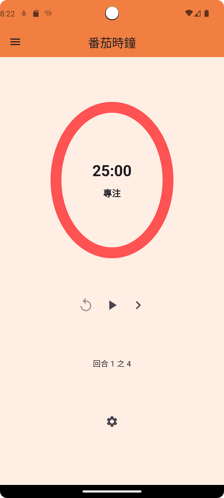
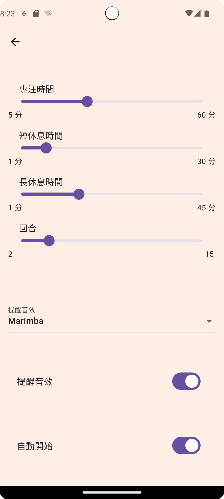

# 番茄運動時鐘

自律人專用APP，靜態與動態功能一次擁有，全面提升你的效率與健康！

## 功能介紹

* 運動時鐘

  
  

運動時鐘的循環階段
運動 -> 休息 -> 預備階段
只需將手機放在地上即可專心運動和調整姿勢，不用在意時間。
預備階段讓您享有完整的休息和運動時間！

* 番茄時鐘

  
  

番茄時鐘的循環階段
(專注 -> 短休息 )* 3 + 專注 -> 長休息
每顆番茄都是專注與休息的結晶，這樣的時間規劃必定讓你獲得充分休息與成長！

